<!-- github.com/insomniac-asif — profile README -->



<p>
  <a href="https://absentbornlabs.org"></a>
  <a href="https://absentbornlabs.org/writing/"></a>
  <a href="mailto:ahossa21@gmail.com"></a>
  <a href="https://www.linkedin.com/in/asif-hossain-90799635b/"></a>
</p>

Self-taught systems builder working on **AI-agent reliability** — honesty, calibration, and grounding tooling that gets models to know what they don't know, abstain instead of confabulate, and be straight about what they actually did.

Alongside that I run **[ABL](https://github.com/insomniac-asif/abl-core)**, a local-first personal-AI system that lives entirely on my own hardware (local models only, nothing personal leaves the machine), and I build applied agents — a multi-server Discord bot and a crypto news event-study engine.

I'm on leave from a CS degree, spending the time building and shipping real systems end-to-end instead. The work below is where that time went.

```text
NOW  ▸ able-origin — a 29.9M-param LM trained from scratch on one RTX 3070 Ti (2.0B tokens, 9h)
     ▸ Able 1.0 — the lab's own routed model: multi-teacher distillation + identity finetune
     ▸ absentbornlabs.org — "The Descent": hand-built scroll narrative, GSAP + one WebGL shader
     ▸ 27B models on an 8 GB GPU, measured honestly → absentbornlabs.org/writing/27b-on-8gb
```

---

### 🛰 able-origin — a language model born on a gaming GPU

<p>
  
  
  
</p>

**[able-origin](https://github.com/insomniac-asif/able-origin)** — architecture written from a blank file, byte-level BPE tokenizer trained from raw text, weights initialized random and pretrained end-to-end: 2.0B tokens in 9 hours on a single 8 GB consumer card. No base model, no forked training code, no inherited weights.

The README states its limits as plainly as its results: it writes children's stories, the architectural blocks are standard published techniques implemented originally, and 30M parameters is a research artifact — not an assistant.

---

### Honesty & calibration — measuring where models are (over)confident

- **[honest-confidence](https://github.com/insomniac-asif/honest-confidence)** — a deterministic honesty layer (confidence-capping + grounding-abstain) with a reproducible TruthfulQA eval. On a 4-seed run it cut calibration error ~3.4× (0.48 → 0.14 ECE) — and reports the cost right next to the win: ranking AUROC slips toward chance, and the "zero confident falsehoods" result is undefined-by-construction, not actually zero.
- **[honest-quant](https://github.com/insomniac-asif/honest-quant)** — measures how quantization shifts a local model's calibration (ECE, Brier, AUROC, confidently-wrong rate), not just speed. Fully offline test suite, Ollama mocked. The one committed run refutes its own hypothesis: quantization didn't reliably increase overconfidence.

### Agent-reliability tooling — small, zero-dependency, runs offline

- **[receipts](https://github.com/insomniac-asif/receipts)** — reconciles what an agent *claimed* it did against its actual tool-call trace, flagging phantom actions and silent failures.
- **[toolcall-rescue](https://github.com/insomniac-asif/toolcall-rescue)** — salvages tool calls that leaked into message content as XML, dirty JSON, Hermes tags, or fullwidth-unicode DSML. A fallback for when a model ignores the structured `tool_calls` field.
- **[egress-guard](https://github.com/insomniac-asif/egress-guard)** — a policy gateway that decides whether an outbound payload may reach a hosted LLM or search provider. Every fault path degrades toward PERSONAL (a broken detector is always a denial), "public" must be positively asserted, and a stdlib-only AST guard catches un-gated calls inside background loops — where these leaks actually hide. It gates calls made *through* it, not raw sockets: a choke point, not a network control.
- **[break-your-agent](https://github.com/insomniac-asif/break-your-agent)** — an offline lab for how tool-calling agents get prompt-injected: 11 attacks, 4 toggleable defenses, a red/green scorecard. The honest finding: model alignment isn't a security boundary — only the architectural defenses hold every time.

### Applied systems

- **[abl-core](https://github.com/insomniac-asif/abl-core)** — the parts of ABL that are about engineering rather than about me, extracted and runnable: an egress gateway that classifies every outbound request (~650 lines), a long-term memory layer with vector and structured recall, contradiction detection and supersession (~3,800), and a safety layer covering prompt-injection filtering, hallucination flags and invariant checks (~1,850). 128 passing tests. The full system stays private because it holds my own data.
- **[futures-signal-engine](https://github.com/insomniac-asif/futures-signal-engine)** — decision-support for discretionary futures trading (ES/NQ/GC). It surfaces setups, enforces risk constraints, and simulates outcomes — it does not place orders. A fail-closed go-live gate keeps every strategy on paper until it clears explicit criteria, and `real_money_enabled` defaults to `false`. The repo also keeps a leakage investigation in which I found lookahead in my own data pipeline and invalidated my own prior performance numbers — kept deliberately, because the finding is worth more than the results it killed.
- **[doll-bot](https://github.com/insomniac-asif/doll-bot)** — one Discord bot for many servers: AI that does real admin work, but every tool is permission-tiered (MOD/ADMIN/OWNER) and destructive ones are confirm-gated. Node / discord.js.
- **[abl-demo](https://github.com/insomniac-asif/abl-demo)** — a clean-room showcase of ABL's multi-agent architecture: a peer bus and a propose → challenge → execute protocol that requires 3/3 consensus, with a human as the only tiebreaker.
- **[news-crypto-engine](https://github.com/insomniac-asif/news-crypto-engine)** — ingests crypto news, classifies events into 8 categories, and runs an event study on whether they move price. Most category/window combinations show no signal — and it says so.

Each repo's README writes its own limitations and costs in as first-class results. A method that only reports its wins isn't a measurement.

---

<p>
  
  
</p>

**Tech:** Python · TypeScript · JavaScript · FastAPI · React · local LLMs / llama.cpp / Ollama · SQLite & vector search · discord.js · Playwright · Cloudflare

**How I work:** honesty-first — I'd rather report a smaller number I can defend than a big one I can't. Mechanistic — I don't trust a system until I understand how it computes, not just what it outputs. And I verify my own work end-to-end before I call it done.

<sub>📫 ahossa21@gmail.com &nbsp;·&nbsp; 🛰 <a href="https://absentbornlabs.org">absentbornlabs.org</a> &nbsp;·&nbsp; the lab runs local — cloud absent by design</sub>
